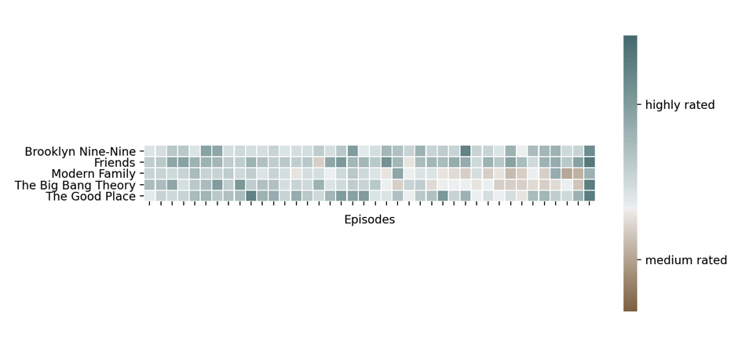

## Background

My girlfriend and I have recently started watching a few TV sitcoms that have recently finished, many of which we didn't catch the first time around. To help embed my knowledge of Python and data visualisation, I thought it'll be a good idea to visualise these shows and see how they stand up over their many seasons.

I like to reuse code and so whilst it would be much easier to hard code a lot of this, I wanted to include as much re-usability as possible.

**Note:** Being an avid R user, I've found RStudio to be a good Python editor. The R Markdown visual editor is also a great tool, so whilst no R is used in this markdown, I do utilize the great RStudio tools available to me.

## Which TV series should we compare?

We've recently started watching Modern Family. I saw a few episodes when season one came out and loved it, but I couldn't find time to keep up to date. My girlfriend has never seen it so we thought we'd give it a go. We're both fans of Brooklyn Nine-Nine and we've recently re-watched The Good Place. The Big Ban Theory was added as it's a good sitcom and has a similar length to Modern Family. Finally, I've added Friends, to see if any of the sitcoms can beat a classic.

```{python titles, echo = TRUE, results = "hide"}
titles = ("Modern Family", "The Big Bang Theory", "Friends", "The Good Place", "Brooklyn Nine-Nine")
```

These are added as a tuple at the start of my code, as they don't require any additional libraries and with the aim of keeping my code re-usable, it makes it easier to find the code that changes the TV series we're going to compare.

## Libraries

First, I load the libraries that I'll be using for this project.

```{python libraries, echo = TRUE, results = "hide"}
# The standard libraries for advanced data frame and numerical processing.
import pandas as pd
import numpy as np

# The libaries that I'll be using for my plots
import matplotlib.pyplot as plt
from matplotlib.colors import TwoSlopeNorm
import seaborn as sns

# I used the scipy package for a smoothing function that I'll explain later in this document
import scipy as sp

# And finally, the IMDb package used to extract the ratings data
from imdb import IMDb
```

## Extracting the IMDb ratings

### Building the functions

The IMDb library allows you to search for a TV Series or Movie, extract information about the series and extract information about each episode.

Each movie, TV series and episode has a unique ID. I could search the IMDb website for the TV Series I'm interested in to get these ID's, however this wouldn't allow me to reuse the code again.

I've therefore opted to search for a TV series and in the hope that it's a popular series, extract the first record that IMDb returns. This of course may not work if the TV series is based on a movie or is unpopular. Perhaps I could spend more time amending the function to cater for this, however I'll leave that for another time.

I start with writing two basic functions to create an IMDb link object and to then use this to search for a title, returning the ID of the first result.

With each IMDb function, I decided to allow for an optional input of an IMDb link, or, if none is provided, for the function to create it's own.

```{python IMDbSetup, echo = TRUE, results = "hide"}
## Sets up the basic use of the IMDb library, if one hasn't already been created.
def imdb_setup():
  from imdb import IMDb
  return IMDb()
 
## Function to search the IMDB database for TV Series and return the movieID number.
 #   title = the TV series to search
 #   ia = the imdb link. If none provided, this function will create one.
def imdb_search(title, ia = None):

  # If no IA provided, create one using the function above
  if ia == None:
    ia = imdb_setup()

  # Search the IMDB database, using the IMDb library and obtain the first result, most popular result
  # This can easily be used to search the list and pick one, however for automation, it'll pick the most likely case
  search_imdb = ia.search_movie(title = title)
  
  # Use the search results to obtain the movieID reference, to be used in other functions.
  movie_ID    = search_imdb[0].movieID
  return movie_ID

```

I then create a function that will use the returned ID to extract information about the series. There is an optional argument `episodes`, which if true, will also allow us to extract more information about each episode.

```{python IMDbSeries, echo = TRUE, results = "hide"}
## Function to extract the IMDb series object. This contains the ratings, among other information.
 # movie_ID = the movie ID unique identifer used by IMDB for this particular TV Series
 # episodes = Boolean. Return the ratings for each episode? This takes a bit longer to extract.
def imdb_series(movie_ID, episodes = True, ia = None):
  if ia == None:
    ia = imdb_setup()
  if episodes:
    series = ia.get_movie(movie_ID, info = ("episodes"))
  else:
    series = ia.get_movie(movie_ID)
  return series
```

I then create a function that will extract the detailed information about each episode for a given TV Series.

Whilst there's a lot of information I could gather here, I've opted to collect information about the season number, the episode number (within that season), the original aired date, the title of the episode and the episode rating.

I've also added an optional argument `demographics`, which if True, will return the ratings split by gender. I don't use this argument in this exercise, however I might return to it one day.

```{python IMDbEpisodes, echo = TRUE, results = "hide"}
## A function that allows us to obtain the details of each episodes
 # series = IMDb movie object, returned in imdb_series
 # demongraphics = Boolean, to return ratings by gender
def imdb_episodes(series, demographics = False, ia = None):
  # If no IA provided, create one using the function above
  if ia == None:
    ia = imdb_setup()
  
  # create a dataframe with the columns we want to return
  df = pd.DataFrame(columns = ["season", "episode", "aired", "title", "rating"])
  
  # loop through every episode of every season to obtain required information
  for seasons in series.data["episodes"]:
    season = series.data["episodes"][seasons]
    for episodes in season:
      episode = series.data["episodes"][seasons][episodes]
      
      sea           = episode.get("season")
      epi           = episode.get("episode")
      air           = pd.to_datetime(episode.get("original air date"))
      title         = episode.get("title")
      rating        = episode.get("rating")
    
      new_row = {"title" : title, "rating" : rating, "season" : sea, "episode" : epi, "aired" : air}
    
      # If demogragics = True, obtain the individual male/female ratings for each episode
      if demographics:
        epi_vote_det  = ia.get_movie_vote_details(episode.movieID)
        rating_male   = epi_vote_det["data"]["demographics"]["males"]["rating"]
        rating_female = epi_vote_det["data"]["demographics"]["females"]["rating"]
        new_row["rating_male"] = rating_male
        new_row["rating_female"] = rating_female

      df = df.append(new_row, ignore_index = True)
      df["row"] = np.arange(df.shape[0])
    
  return df
```

### Extracting the TV series

I now have all the functions needed to extract the episode information for any given TV series. However, so far, this is only allowing me to extract one TV series at a time. For the plots, I'll want a data frame that contains all the TV series.

I therefore create one more function that takes the tuple of TV series and loops through each series using the functions created above.

```{python ExtractEpisodesFunction, echo = TRUE, results = "hide"}
# Function that will take all of the IMDB functions and extract/return a final dataset.
# This can be used for a single TV series, or a tuple of many.
def extract_TV_Ratings(titles = "", demographics = False):
  # Create an empty dataframe, which will be used to store the data
  df = pd.DataFrame()
  
  # Identify if the type of data is a string or tuple. 
  #  If string, search for the single TV series. 
  #  If tuple, loop through each TV series.
  if type(titles) == str:
    movie_ID     = imdb_search(titles)
    series       = imdb_series(movie_ID)
    df           = imdb_episodes(series, demographics)
    df["series"] = titles

  if type(titles) == tuple:
    for title in titles:
      movie_ID       = imdb_search(title)
      series         = imdb_series(movie_ID)
      temp           = imdb_episodes(series, demographics)
      temp["series"] = title
      df = df.append(temp, ignore_index = True)
  return df
```

And finally, all it takes to extract the information is one more line of code, calling this function.

```{python ExtractEpisodes, echo = TRUE, results = "hide"}
# Use the extract_TV_Ratings function to extract the TV series data of the titles object.
#   extracting many TV series will take some time
data = extract_TV_Ratings(titles, demographics=False)
```

Here is what the head of this data frame looks like.

```{python DataframeHead, echo = FALSE}
data.head()
```

I'd also written functions to find and extract the logo of each TV series from Wikipedia. I planned to use those logos in the plots, however I've decided to explore those functions in a future task and so removed them from here.

## What does the data tell us?

Now we have our data, lets explore what this looks like.

#### Mean rating per season

I start of exploring the mean rating for each season per series. This takes the mean rating for all episodes per season and plots it on a seaborn lineplot.

To add a little smoothness to the lineplot, I use the scipy function `sp.interpolate.make_interp_spline`.

```{python season_mean, echo = TRUE}
# Create a new dataframe, containing the mean for each season, removing an episodes that don't have a rating (you often see NA's in future or unaired episodes)
season_mean = data
season_mean = season_mean.groupby(["series", "season"], as_index = False)["rating"].mean()
season_mean = season_mean[season_mean["rating"].notna()]

# Create a smooth plot based on the mean ratings per season
# Start by creating an empty dataframe, containing just the data needed for the plot.
chart_data = pd.DataFrame(columns = ["x", "y", "series"])
# Then loop through each TV Series
for series in season_mean["series"].unique():
  df = season_mean[season_mean["series"] == series]
  x = df["season"]
  y = df["rating"]
  
  # Use the make_interp_spline function to smooth the plot by having 300 points on the x axis.
  a_BSpline = sp.interpolate.make_interp_spline(x, y)
  new_x = np.linspace(1, len(df), 300)
  new_y = a_BSpline(new_x)
  dt    = {"x" : new_x, "y" : new_y }
  dt    = pd.DataFrame(dt)
  dt["series"] = series
  chart_data = chart_data.append(dt, ignore_index = True)

# Plot the smoothed data
_ = sns.lineplot(x = "x", y = "y", hue = "series", data = chart_data, linewidth = 2, alpha = 0.8).set(ylim=(7,10), xlabel = "Season", ylabel = "Rating", title = "Mean Ratings per Season for each TV Series")
plt.show()
```

This is fine. It shows that **Friends** has had consistent ratings each season, with a slight increase in it's final season. It also shows **Modern Family** and **The Big Bang Theory** start off good but generally get worse near the end.

However, does this show the full picture? It misses out the highs and lows of each season. Do those series with a poorer final season have any good episodes at the end? Do any of the highly rated seasons have any really bad episodes, or maybe an outlier that skews the results?

#### Distribution of ratings

Next, I'll try a KDE plot to see the distribution of ratings each TV series.

```{python KDEPlot, echo = TRUE}
# Distribution of ratings
p = sns.kdeplot(x = "rating", data = data, hue = "series", alpha = 0.4)
_ = p.set(xlim=(5, 10), xlabel = "Rating", title = "Distribution of Ratings per TV Series")
plt.show()
```

This is better. You can now see the general shape of each series.

-   The taller the distribution, the more episodes the series had. You can easily see this with **The Good Place**, which only had four seasons, with a few episodes each.

-   The more right each distribution is, the more higher ratings the series received. The opposite is also true, the more left each distribution is, the more lower ratings the series received.

It's clear **Friends** had many episodes, and is the most consistently highly rated. **The Big Bang Theory** is unusual, in that the ratings are the least like a Bell Curve, with more episodes being rated a 7 or 8 rather than in-between.

The downside of the distribution curve is that it gets harder to see the outliers and extremes. **Modern Family**, **Brooklyn Nine-Nine**, and **The Big Bang Theory** have all had good and bad episodes, but just how good or bad were they?

#### A Violin Plot

I find the best way to see just how good and bad some episodes were, whilst being able to visualise the distribution is with a violin plot.

```{python ViolinPlot, echo = TRUE}
# Violin plot of all episodes
violin = sns.violinplot(x = "series", y = "rating", data = data, alpha = 0.8)
violin = violin.set(ylim=(5,10), title = "Distribution of ratings", xlabel = "TV Series", ylabel = "Rating")
plt.show()
```

**Modern Family** has the worst rated episodes of each series, followed by **Brooklyn Nine-Nine**, however these are in the minority, with most episodes being rated between 7 to 8.

As before, **Friends** is clearly rated better, with almost no episodes being rated below a 7. This is followed closely by **The Good Place**.

However, whilst we can now see the distribution, you can no longer see how the ratings relate to each season. We know from before that the later seasons of some series received lower ratings, but we can't see that in this chart.

#### The bar-code

Whilst not technically called a bar code plot, that's what I like to call the next plot.

I use a heatmap to create a sub plot of every TV series. Whilst a typical heatmap would show one series, maybe with the episode and season on the x and y axis, I instead have the y axis / sub plot as a TV series and the x axes is every episode in order, from the first to the last. The color shows the rating.

As each series has a single row and each series has many episodes (across all seasons), this results in what looks like a colored barcode of each TV series, showing the rating for each episode.

Left as is, this would show uneven plots, as each TV series has a different number of episodes. I therefore create a function that normalizes each TV series. Effectively, if one series had 100 episodes and another had 50, then a new dataframe of 100 rows is created. The larger TV Series has one row per episode, whilst the smaller TV series would increase to 100 rows, with each episode representing 2 rows.

```{python norm_fill, echo = TRUE}
def norm_fill(df, size = None):
  if size == None: no_row = len(df)
  else: no_row = size
  no_col = len(df.columns)
  
  new_df = pd.DataFrame(index = range(no_row), columns=df.columns)

  for col in df:
    colSeriesObj = df[col]
    mx = no_row
    le = len(colSeriesObj.dropna())

    diff = mx/le
    
    for index in range(le):
      old = int(index)
      new = int(old*diff)
      new_df.loc[new, col] = df.loc[old,col]
    
  return new_df.fillna(method = "ffill")
```

You'll notice I allow for an optional argument for the size. By default, the size will be the size of the TV series with the most episodes, but I can increase or decrease this.

Whilst decreasing should use a more scientific method, maybe by taking the mean or median between episodes, it currently uses a simple approach of skipping out episodes. For example, if the 100 episode TV series was reduced to 50 rows, it would show every other episode.

```{python heatmap_one, echo = TRUE}
heatmap = data[data["season"] <= 99][["series", "row", "rating"]].pivot(index = "row", columns = "series", values = "rating")

def plot_func(df, size = None, square = False, linewidth = 0.0):
  # Use the previously defined function to create a new normalised data frame
  df = norm_fill(df, size)
  
  # I then use the matplotlib TwoSlopeNorm function to create a diverging color palette. This allows me to have a two colored gradiant from medium to highly rated.
  # The lowest value is 6 (any ratings below 6 will have the same color) and the maximum value is 10, as no rating can exceed this. I then set the centre (where the colors start to change) as 7.5.
  divnorm = TwoSlopeNorm(vmin=6, vcenter=7.5, vmax=10)
  cmap = sns.diverging_palette(50, 200, 50, 50, as_cmap=True)

  # I then create the plot, with a figure size of 16 by 8 and add the titles and labels.
  fig,ax = plt.subplots(1,1,figsize=(16,8))
  _ = sns.heatmap(df.T, cmap = cmap, linewidth = linewidth, cbar_kws={"shrink" : 0.6}, square = square, norm = divnorm, ax = ax)
  _ = _.set(ylabel = None, xlabel = "Episodes", xticklabels = [], title="Ratings per episode")
  
  # I then adjust the plot sightly as this seems to fit better
  ax.figure.subplots_adjust(left = 0.2)
  
  # Finally, I amend the color labels. Rather than show ratings 6 to 10, I display the words "medium rated" and "highly rated" in the middle of the colors.
  colorbar = ax.collections[0].colorbar
  colorbar.set_ticks([6.75,9])
  colorbar.set_ticklabels(['medium rated','highly rated'])
  plt.show()

plot_func(heatmap)
```

I like this plot. You can easily see which TV series has more episodes, through the thickness of each bar (the thicker each bar is, the fewer number of episodes there is). You can also easily see if a series as consistently been good or bad, or changed nearer it's end.

**Friends**, as expected is the most consistently highly rated, with maybe just one medium rated episode. **The Good Place** is highly rated, but with fewer episodes. **Brooklyn-Nine-Nine** has only a few medium rated episodes, but is still going well and hasn't finished it's run. **The Big Bang Theory** however started it's run of medium rated episodes before **Modern Family** did and you can also see their unaired pilot being rated fairly low too.

As much as I like this visualization, I feel we can utilize the `norm_fill` function to provide a cleaner, squarer plot. I use the exact same plot as above, however I use norm_fill with a size of 40, with the `Square = True` and `linewidth = 0.5`.

## The final plot

```{python Final_Plot, echo = TRUE}
heatmap = data[data["season"] <= 99][["series", "row", "rating"]].pivot(index = "row", columns = "series", values = "rating")

plot_func(heatmap, size = 40, square = True, linewidth = 0.5)
```

And there we have it. My final visualization of how highly rated each TV Series is and how it changes over their seasons, along with a code that is reusable and easily changeable to show other TV Series. Not bad for under 130 lines of code (excluding comments)... on that note, just how bad were the final few episodes of Game of Thrones?

###### Bonus Plot

```{python bonus_plot, echo = FALSE}
bonus_titles = ("Game of Thrones")
bonus_data = extract_TV_Ratings(bonus_titles, demographics=False)

bonus_heatmap = bonus_data[bonus_data["season"] <= 99][["series", "row", "rating"]].pivot(index = "row", columns = "series", values = "rating")

plot_func(bonus_heatmap, square = False, linewidth = 0.2)
```
